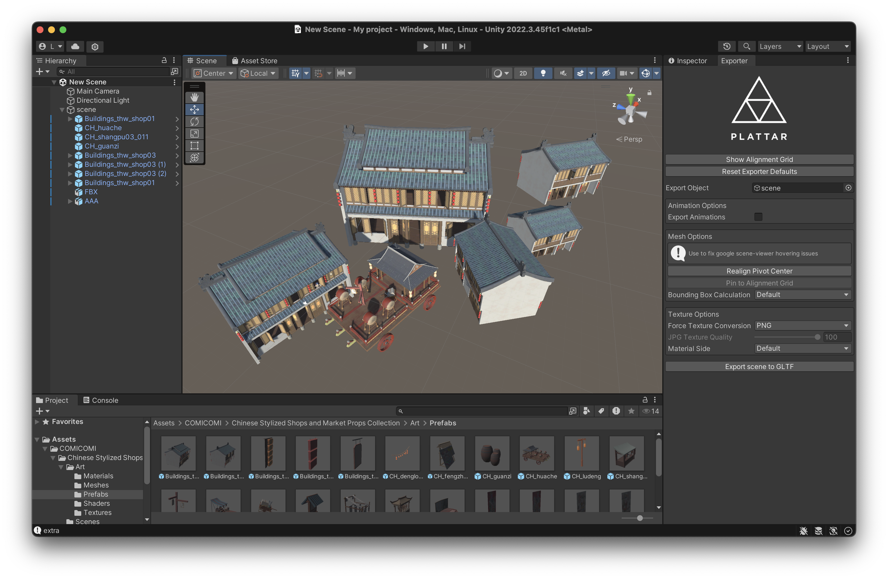
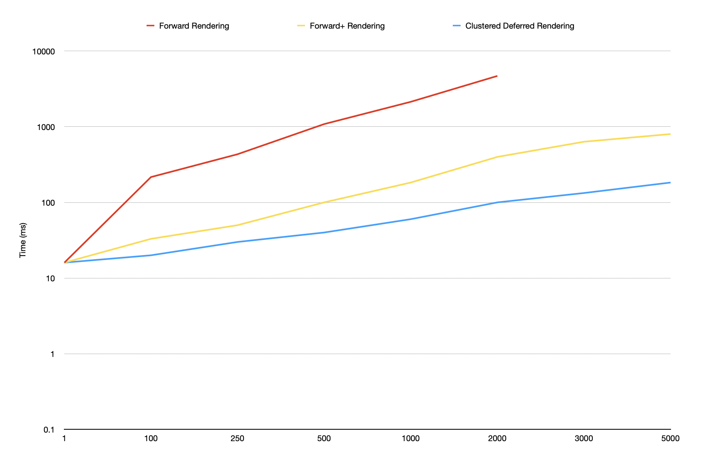

WebGL Forward+ and Clustered Deferred Shading
======================

**University of Pennsylvania, CIS 565: GPU Programming and Architecture, Project 4**

* Deze Lyu
* Tested on: **Google Chrome Version 129.0.6668.101** on macOS Sonoma Version 14.5, Apple M1 16GB

### Final Demo

The final demo is deployed as a GitHub Pages website and can be accessed [here](https://dezelyu.github.io/CIS565-Project4/).

The scene was constructed in **Unity**, utilizing an environment asset purchased from the Unity Asset Store, which was modified to suit the project's objectives. The character model was designed and released by Hoyoverse for non-commercial use in compliance with their legal guidelines.

Please note that the final demo scene has been created on a separate branch named **creative**, as the base code was extensively modified to achieve the objectives.

### Basic Demo

This is a screen recording of the basic demo showcasing the togglable rendering techniques: forward rendering, forward+ rendering (which clusters lights in a compute pass), and clustered deferred rendering, which also utilizes the clustered light data.

The basic demo is located on the **main** branch. The animated image above showcases the clustered deferred rendering, achieving approximately 30 FPS in a fullscreen Chrome browser on my MacBook Pro. In comparison, the forward+ rendering achieves around 10 FPS, while the pure forward rendering reaches only 1 FPS.

### Performance Analysis

The three rendering techniques operate as follows: forward rendering processes objects in a single pass, shading them immediately with all lights, regardless of occlusion. In contrast, forward+ rendering optimizes performance by first clustering lights in a compute pass and shading only the visible lights for objects. Meanwhile, clustered deferred rendering enhances this approach by separating the geometry pass from the shading pass, allowing for the shading of only the visible objects after they have been determined.

As a result, clustered deferred shading is anticipated to deliver the best average performance, since the renderer consistently shades a number of pixels proportional to the total number of fragments on the screen.

Although forward+ rendering clusters lights, it still shades all objects regardless of occlusion, which can bottleneck performance. Nevertheless, in scenarios with minimal occlusion, forward+ rendering may outperform clustered deferred rendering, as it does not require a separate geometry pass.

Finally, pure forward rendering is considered the slowest method, as it shades occluded objects and accounts for all lights, regardless of their visibility.

The graph above illustrates the rendering time in milliseconds as the number of lights increases for the three rendering techniques, aligning with our expectations. It is important to note that the graph employs a logarithmic scale on the y-axis, indicating that the actual trends are more pronounced than they appear.

### G-Buffer Optimization

Clustered deferred rendering utilizes a single intermediate texture formatted as RGBA32FLOAT to pack both color and normal data. This approach allows the geometry pass to employ a single color attachment, rather than multiple attachments, each sized to a vec4f data type. As a result, this method effectively reduces memory read and write operations.

### Credits

- [Vite](https://vitejs.dev/): A fast build tool and development server for modern web projects.
- [loaders.gl](https://loaders.gl/): A suite of libraries for loading and processing geospatial data.
- [dat.GUI](https://github.com/dataarts/dat.gui): A lightweight GUI for changing variables in JavaScript.
- [stats.js](https://github.com/mrdoob/stats.js): A performance monitor for tracking frames per second and memory usage.
- [wgpu-matrix](https://github.com/greggman/wgpu-matrix): A WebGPU matrix math library for efficient computations.
